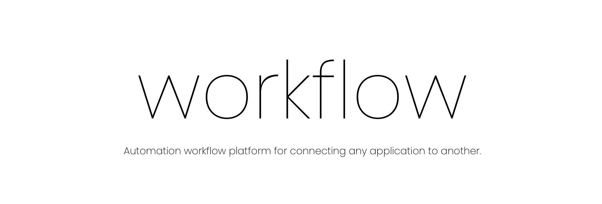

Servo is a REST-based go server framework (micro) for creating high-performance API applications. It's a good starting point for developers, allowing them to focus on creating something amazing while the servo sweat over the smaller details.

For the release info, see the  [Development plan](https://www.notion.so/Servo-5c946869052947c3b0baf5a5f508ec92).

# Contributions

Feel free to reach me out at [rec.manish.sahani@gmail.com](mailto:rec.manish.sahani@gmail.com) or connect with me on [LinkedIn](https://www.linkedin.com/in/manishsahani).

